<!-- Typing SVG Header -->

 

<samp>Building intelligent systems at the intersection of AI, IoT & the Web</samp>

  

<!-- Social badges -->

---

## ⚡ About Me

<table>
<tr><td>🎯 <b>Role</b></td><td>AI & Full-Stack Developer</td></tr>
<tr><td>🔭 <b>Focus</b></td><td>Generative AI · Deep Learning · IoT Systems · Web Apps</td></tr>
<tr><td>🏗️ <b>Building</b></td><td>Agro AI - An Intelligent Framework for Sustainable Farming and Crop Management </td></tr>
<tr><td>🌱 <b>Learning</b></td><td>Applied ML · Cloud-native IoT · LLM Fine-tuning</td></tr>
<tr><td>⚡ <b>Fun fact</b></td><td>I love coffee ☕</td></tr>
</table>

---

## 🛠️ Tech Arsenal

| Domain | Technologies |
|--------|-------------|
| **Languages** |       |
| **AI / ML** |    |
| **Web** |      |
| **IoT & Embedded** |    |
| **DevOps & Tools** |     |
| **Game Dev** |   |

---

## 📊 GitHub at a Glance

<!-- Auto-generated by .github/workflows/generate-stats.yml -->

  
   
  
   
  

---

## 🔥 Contribution Streak

  

---

## 🌱 What I'm Building

- 🧠 **Generative AI** — LLM-based tools & fine-tuning experiments
- 🌐 **Full-Stack Apps** — Django + React production systems
- 📡 **IoT Platforms** — OTA updates, cloud telemetry, STM32 firmware
- 🤖 **ML Pipelines** — End-to-end model training & deployment

---

<samp><b>Thanks for stopping by!</b> Let's build something amazing together 🚀</samp>

